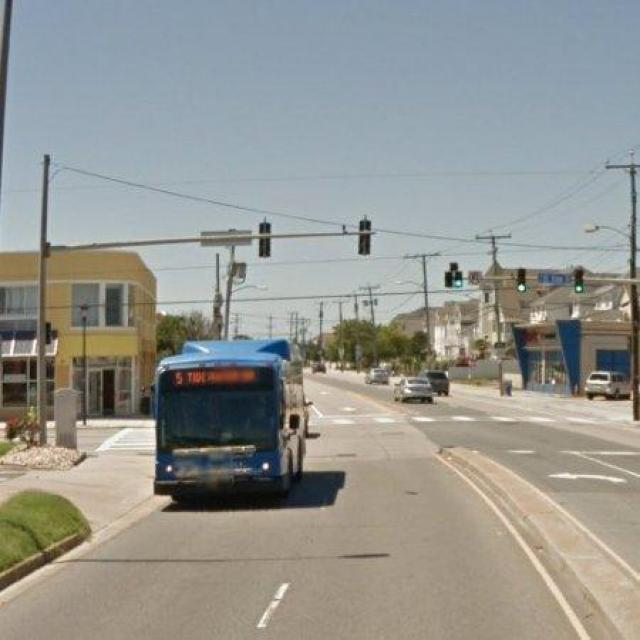

# Transformers.js Object Detection Demo

A simple web app for object detection in images using [Transformers.js](https://xenova.github.io/transformers.js/) and the YOLOS-tiny model.

## Features

- Detects objects in images using the YOLOS-tiny model.
- Draws bounding boxes and labels for detected objects.
- Easy-to-use web interface.

## Getting Started

1. **Clone or download this repository.**
2. Make sure you have an image named `road.jpeg` in the project folder (or update the image source in [`index.html`](index.html)).
3. Open [`index.html`](index.html) in your browser.

## How It Works

- The app loads the YOLOS-tiny object detection model from Transformers.js.
- Click **Detect Objects** to run detection on the displayed image.
- Detected objects are highlighted with bounding boxes and labels.

## Files

- [`index.html`](index.html): Main HTML file.
- [`index.js`](index.js): JavaScript logic for loading the model and drawing boxes.
- [`style.css`](style.css): Basic styling for the app.

## Model

Uses [`Xenova/yolos-tiny`](https://huggingface.co/Xenova/yolos-tiny) via Transformers.js.

## Demo Screenshot

## License

This project is for educational/demo purposes.